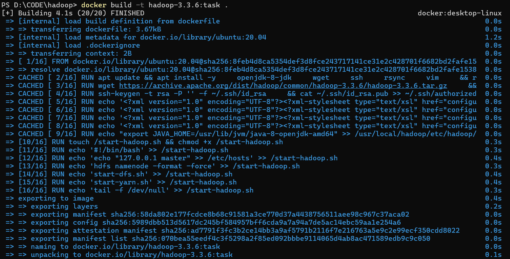
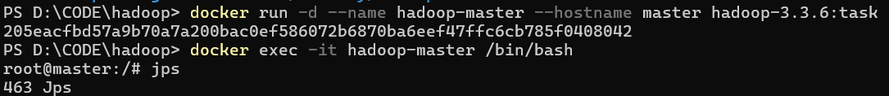
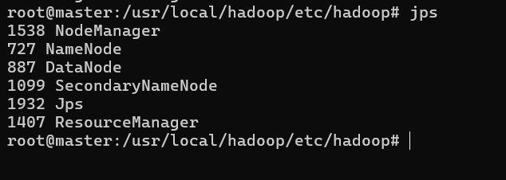
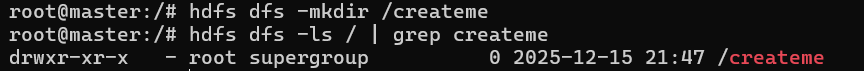
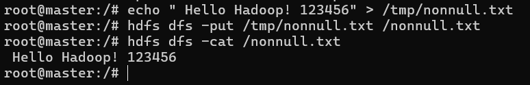
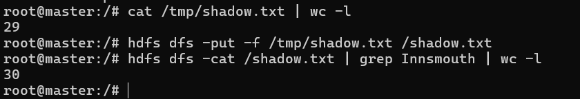
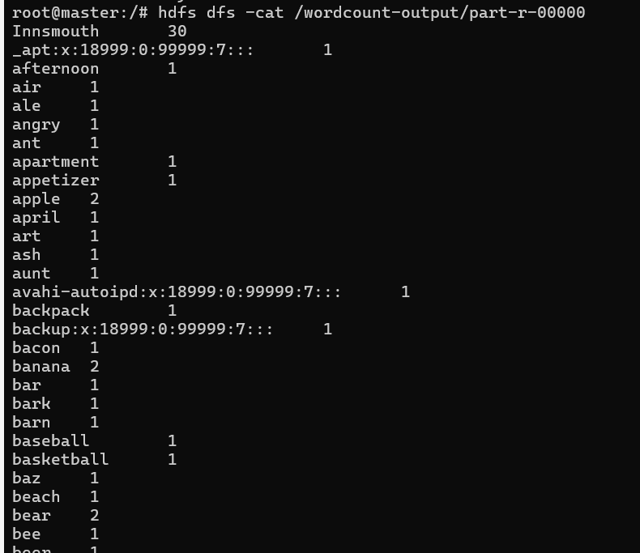
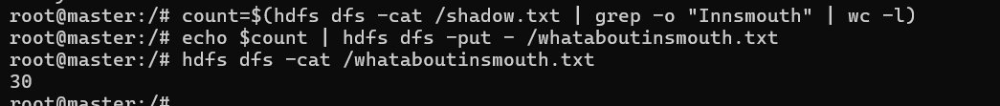

# HW1

Build the image

​`cd`

​`docker build -t hadoop-3.3.6:task .`



run docker



HDFS and YARN services failed to start successfully

```bash
# Start the SSH service
service ssh start

# Verify if SSH is started
ps -ef | grep sshd  # If you can see the sshd process, it means success.

cd $HADOOP_HOME/etc/hadoop

# 2. Fix hadoop-env.sh (add the missing environment variables)
echo "export HDFS_NAMENODE_USER=\"root\"" >> hadoop-env.sh
echo "export HDFS_DATANODE_USER=\"root\"" >> hadoop-env.sh
echo "export HDFS_SECONDARYNAMENODE_USER=\"root\"" >> hadoop-env.sh
echo "export YARN_RESOURCEMANAGER_USER=\"root\"" >> hadoop-env.sh
echo "export YARN_NODEMANAGER_USER=\"root\"" >> hadoop-env.sh

# 3. Reformat HDFS (force overwrite)
hdfs namenode -format -force

# Start HDFS
start-dfs.sh

jps  # At this point, you should see NameNode, DataNode, and SecondaryNameNode.

# Start YARN
start-yarn.sh

jps
```



task 1 Создайте директорию на HDFS /createme

​`hdfs dfs -mkdir /createme`



task 2 Удалите директорию на HDFS /delme


task3 Создайте файл на HDFS /nonnull.txt с произвольным содержимым:



task4 Выполните джобу MR wordcount через YARN для файла /shadow.txt

submit shadow.txt in docker



Rewrite the complete mapred-site.xml

```bash
echo '<?xml version="1.0" encoding="UTF-8"?>
<?xml-stylesheet type="text/xsl" href="configuration.xsl"?>
<configuration>
    <property>
        <name>mapreduce.framework.name</name>
        <value>yarn</value>
    </property>
    <property>
        <name>yarn.app.mapreduce.am.env</name>
        <value>HADOOP_MAPRED_HOME=/usr/local/hadoop</value>
    </property>
    <property>
        <name>mapreduce.map.env</name>
        <value>HADOOP_MAPRED_HOME=/usr/local/hadoop</value>
    </property>
    <property>
        <name>mapreduce.reduce.env</name>
        <value>HADOOP_MAPRED_HOME=/usr/local/hadoop</value>
    </property>
</configuration>' > $HADOOP_CONF_DIR/mapred-site.xml

stop-yarn.sh

start-yarn.sh
```

Execute the WordCount task

​`hadoop jar $HADOOP_HOME/share/hadoop/mapreduce/hadoop-mapreduce-examples-3.3.6.jar wordcount /shadow.txt /wordcount-output`

Verify the WordCount results

​`hdfs dfs -cat /wordcount-output/part-r-00000`

task5 Запишите число вхождений слова "Innsmouth" в файл /whataboutinsmouth.txt

​`count=$(hdfs dfs -cat /shadow.txt | grep -o "Innsmouth" | wc -l)`

​`echo $count | hdfs dfs -put - /whataboutinsmouth.txt`


