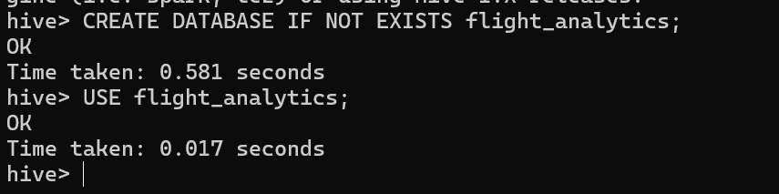
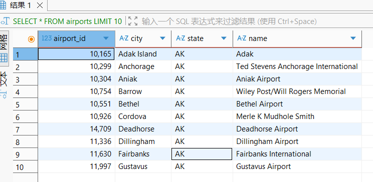
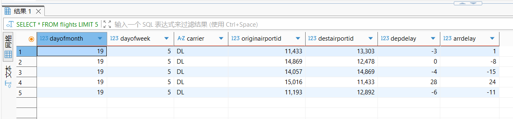
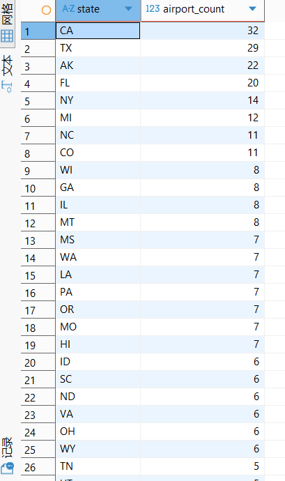
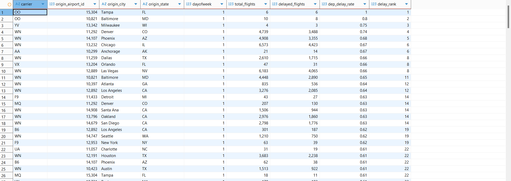
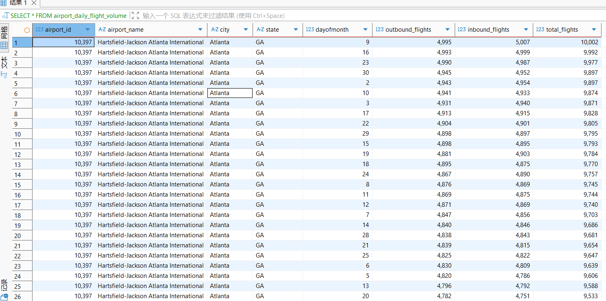
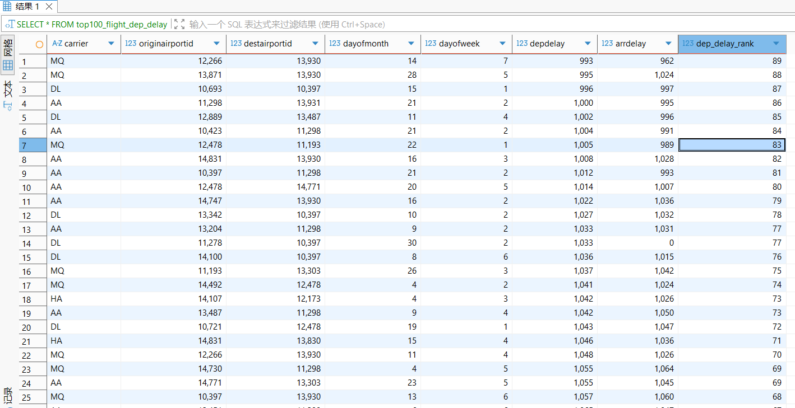
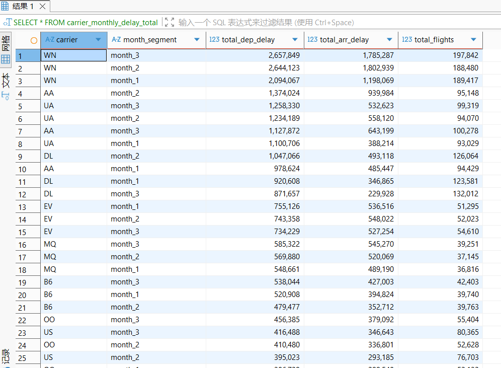

# HW2

1.run docker

```bash
docker-compose build
docker-compose up -d
```

2.Enter Hive CLI

```bash
docker exec -it hadoop-hive bash
/opt/apache-hive-3.1.3-bin/bin/hive
```

### Create a database

```bash
CREATE DATABASE IF NOT EXISTS flight_analytics;
USE flight_analytics;
```



1.Creation of the airport table (airports) + data loading

```bash
CREATE EXTERNAL TABLE IF NOT EXISTS airports (
    airport_id INT COMMENT 'Unique numeric ID of the airport',
    city STRING COMMENT 'City where the airport is located',
    state STRING COMMENT 'State/region of the airport (e.g., AK for Alaska)',
    name STRING COMMENT 'Full name of the airport'
)
ROW FORMAT DELIMITED
FIELDS TERMINATED BY ','  
LINES TERMINATED BY '\n'
STORED AS TEXTFILE
LOCATION '/user/hive/warehouse/flight_analytics.db/airports'
TBLPROPERTIES ("skip.header.line.count"="1");  

LOAD DATA LOCAL INPATH '/opt/datasets/airports.csv'
OVERWRITE INTO TABLE airports;

SELECT * FROM airports LIMIT 10;
```



1.Creation of the flights table (flights) + data loading

```bash
CREATE EXTERNAL TABLE IF NOT EXISTS flights (
    DayofMonth INT COMMENT 'Day of the month (1-31)',
    DayOfWeek INT COMMENT 'Day of the week (1=Monday, 7=Sunday)',
    Carrier STRING COMMENT 'Airline carrier code (e.g., DL)',
    OriginAirportID INT COMMENT 'Departure airport ID (matches airports.airport_id)',
    DestAirportID INT COMMENT 'Arrival airport ID (matches airports.airport_id)',
    DepDelay INT COMMENT 'Departure delay in minutes (negative = early)',
    ArrDelay INT COMMENT 'Arrival delay in minutes (negative = early)'
)
ROW FORMAT DELIMITED
FIELDS TERMINATED BY ','
LINES TERMINATED BY '\n'
STORED AS TEXTFILE
LOCATION '/user/hive/warehouse/flight_analytics.db/flights'
TBLPROPERTIES ("skip.header.line.count"="1");  

LOAD DATA LOCAL INPATH '/opt/datasets/flights.csv' 
OVERWRITE INTO TABLE flights;

SELECT * FROM flights LIMIT 5;
```



# Витрины

1.Ranking of the number of airports in each state（where+group by+having+order by+count）

```bash
CREATE TABLE IF NOT EXISTS airport_count_by_state 
STORED AS ORC AS
SELECT 
    state,
    COUNT(airport_id) AS airport_count
FROM airports
WHERE state IS NOT NULL  
GROUP BY state
HAVING airport_count >= 3  
ORDER BY airport_count DESC;
```



Explanation:

- Show the distribution of the number of airports in U.S. states where the number of airports is ≥ 3, focusing on aviation hub states such as Alaska (AK);

- Use WHERE to filter out null state values, HAVING to narrow down the analysis scope, and ORDER BY to intuitively present rankings;

2.Airlines + Airports Weekly Delay Rate（join+group by+window+where）

```bash
CREATE TABLE IF NOT EXISTS carrier_airport_weekly_delay 
STORED AS ORC AS
SELECT 
    f.Carrier,
    a.airport_id AS origin_airport_id,
    a.city AS origin_city,
    a.state AS origin_state,
    f.DayOfWeek,
    COUNT(f.OriginAirportID) AS total_flights,
    SUM(CASE WHEN f.DepDelay > 0 THEN 1 ELSE 0 END) AS delayed_flights,
    ROUND(SUM(CASE WHEN f.DepDelay > 0 THEN 1 ELSE 0 END) / COUNT(f.OriginAirportID), 2) AS dep_delay_rate,
    RANK() OVER (PARTITION BY f.DayOfWeek ORDER BY 
        ROUND(SUM(CASE WHEN f.DepDelay > 0 THEN 1 ELSE 0 END) / COUNT(f.OriginAirportID), 2) DESC) AS delay_rank
FROM flights f
JOIN airports a ON f.OriginAirportID = a.airport_id 
WHERE f.DepDelay IS NOT NULL 
GROUP BY f.Carrier, a.airport_id, a.city, a.state, f.DayOfWeek;
```



Explanation:

- Display the total number of weekly flights, the number of delayed flights, and the delay rate of each airline at various airports;

- Use JOIN to associate the flight table and the airport table, and supplement the airport city/state dimensions;
- The window function RANK() is used to rank the delay rates of airlines and airports within the same week, which can identify the airports with the most serious delays on weekends or weekdays.

3.The number of daily incoming and outgoing flights at the airport（join+group by+count+order by）

```bash
CREATE TABLE IF NOT EXISTS airport_daily_flight_volume 
STORED AS ORC AS
SELECT 
    ap.airport_id,
    ap.name AS airport_name,
    ap.city,
    ap.state,
    f.DayofMonth,
    COUNT(CASE WHEN f.OriginAirportID = ap.airport_id THEN 1 END) AS outbound_flights,
    COUNT(CASE WHEN f.DestAirportID = ap.airport_id THEN 1 END) AS inbound_flights,
    COUNT(CASE WHEN f.OriginAirportID = ap.airport_id THEN 1 END) + COUNT(CASE WHEN f.DestAirportID = ap.airport_id THEN 1 END) AS total_flights
FROM flights f
JOIN airports ap ON f.OriginAirportID = ap.airport_id OR f.DestAirportID = ap.airport_id
GROUP BY ap.airport_id, ap.name, ap.city, ap.state, f.DayofMonth
ORDER BY total_flights DESC;
```



Explanation:

- Count the number of daily departures, arrivals, and total flights for each airport

- ORDER BY sorts in descending order of total flight volume to quickly locate the busiest airport-date combinations.

4.Top 100 Flights by Delay Duration（window+where+order by）

```bash
CREATE TABLE IF NOT EXISTS top100_flight_dep_delay 
STORED AS ORC AS
SELECT 
    Carrier,
    OriginAirportID,
    DestAirportID,
    DayofMonth,
    DayOfWeek,
    DepDelay,
    ArrDelay,
    DENSE_RANK() OVER (ORDER BY DepDelay DESC) AS dep_delay_rank
FROM flights
WHERE DepDelay > 0  
LIMIT 100;
```



Explanation:

- Display information on the 100 flights with the most severe departure delays, including core fields such as airline, route, and delay duration;

- Use WHERE to filter non-delayed flights
- The window function DENSE_RANK() implements the global ranking of delay durations, enabling quick identification of flights with extreme delays;

5.Monthly total delay volume of airlines（join+group by+sum+having+order by）

```bash
CREATE TABLE IF NOT EXISTS carrier_monthly_delay_total 
STORED AS ORC AS
SELECT 
    f.Carrier,
    CASE 
        WHEN f.DayofMonth BETWEEN 1 AND 10 THEN 'month_1'
        WHEN f.DayofMonth BETWEEN 11 AND 20 THEN 'month_2'
        ELSE 'month_3'
    END AS month_segment,
    SUM(f.DepDelay) AS total_dep_delay,
    SUM(f.ArrDelay) AS total_arr_delay,
    COUNT(f.Carrier) AS total_flights
FROM flights f
JOIN airports a ON f.OriginAirportID = a.airport_id
GROUP BY f.Carrier,
    CASE 
        WHEN f.DayofMonth BETWEEN 1 AND 10 THEN 'month_1'
        WHEN f.DayofMonth BETWEEN 11 AND 20 THEN 'month_2'
        ELSE 'month_3'
    END
HAVING SUM(f.DepDelay) >= 100  
ORDER BY total_dep_delay DESC;
```



Explanation:

- Show the total departure delays, total arrival delays, and total number of flights of airlines in different monthly segments;
- HAVING filters combinations where the total delay is < 100 minutes
- JOIN to associate the airport table
