# report

install PostgreSQL DBeaver locally on windows 11

restore `dvd-rental.backup`,The error occurs because a certain relationship already exists; it does not affect anything.

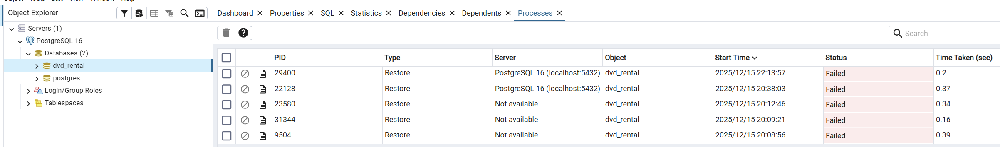

Configure a connection to the installed PostgreSQL server via DBeaver.

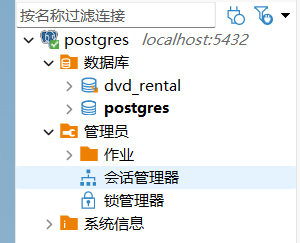

ER diagram

1. Вывести список всех клиентов (таблица customer).

    ​`SELECT * FROM public.customer;`

    
2. Вывести имена и фамилии клиентов с именем Carolyn.

    ​`SELECT first_name, last_name FROM customer
   WHERE first_name = 'Carolyn';`

    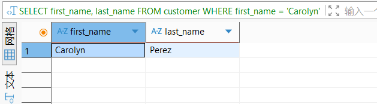
3. Вывести полные имена клиентов (имя + фамилия в одной колонке), у которых имя или фамилия содержат подстроку ary (например: Mary, Geary).

    ​`SELECT CONCAT(first_name, ' ', last_name) AS full_name FROM customer`
    `WHERE first_name LIKE '%ary%' OR last_name LIKE '%ary%';`

    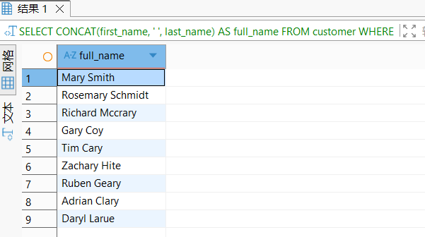

4. Вывести 20 самых крупных транзакций (таблица payment).

    ​`SELECT * FROM payment ORDER BY amount DESC LIMIT 20;`

    
5. Вывести адреса всех магазинов, используя подзапрос.

    ​`SELECT address`
    `FROM public.address`
    `WHERE address_id in (`
    `	SELECT address_id`
    `	FROM store`
    `)`

    
6. Для каждой оплаты вывести число, месяц и день недели в числовом формате (Понедельник – 1, Вторник – 2 и т.д.).`
    SELECT
      payment_id,          
      amount,              
      CASE 
        WHEN EXTRACT(DOW FROM payment_date) = 0 THEN 7
        ELSE EXTRACT(DOW FROM payment_date)::INT
      END AS weekday_num,  
      EXTRACT(MONTH FROM payment_date)::INT AS month_num, 
      EXTRACT(DAY FROM payment_date)::INT AS day_num     
    FROM payment
    ORDER BY payment_id;`

    

7. Вывести, кто (customer\_id), когда (rental\_date, приведенная к типу date) и у кого (staff\_id) брал диски в аренду в июне 2005 года.  
    ​`SELECT
      customer_id AS "ID клиента",
      rental_date::DATE AS "Дата аренды",
      staff_id AS "ID сотрудника"
    FROM rental`

    ​`WHERE
      EXTRACT(YEAR FROM rental_date) = 2005
      AND EXTRACT(MONTH FROM rental_date) = 6
    ORDER BY "Дата аренды", customer_id;`

    

8. Вывести название, описание и длительность фильмов (таблица film),выпущенных после 2000 года, с длительностью от 60 до 120 минут включительно. Показать первые 20 фильмов с наибольшей длительностью.​`
    SELECT
      title AS "Название фильма",  
      description AS "Описание",   
      length AS "Длительность (минуты)"  
    FROM film
    WHERE
      release_year > 2000  
      AND length BETWEEN 60 AND 120  
    ORDER BY length DESC  
    LIMIT 20;  `

    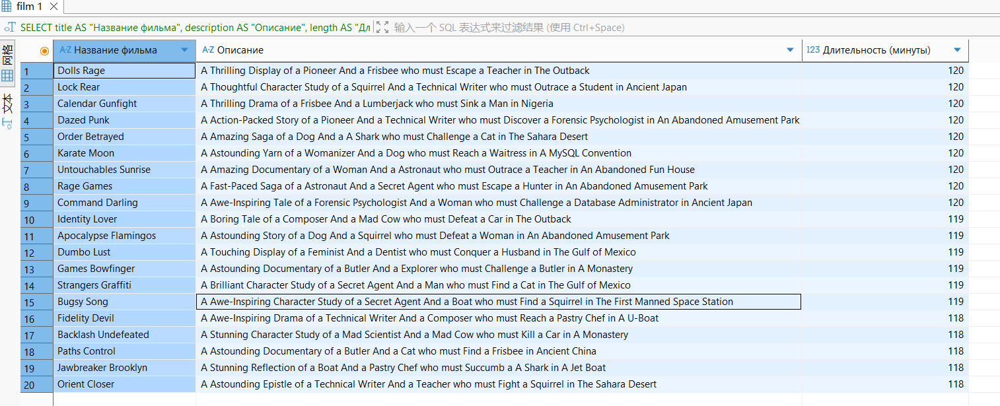

9. Найти все платежи (таблица payment), совершенные в апреле 2007 года,стоимость которых не превышает 4 долларов. Вывести идентификаторплатежа, дату (без времени) и сумму платежа. Отсортировать платежи по убыванию суммы, а при равной сумме — по более ранней дате.

    ​`SELECT
      payment_id AS "Идентификатор платежа",
      payment_date::DATE AS "Дата платежа",
      amount AS "Сумма платежа (USD)"
    FROM payment
    WHERE
      EXTRACT(YEAR FROM payment_date) = 2007 
      AND EXTRACT(MONTH FROM payment_date) = 4
      AND amount <= 4  
    ORDER BY 
      amount DESC,
      payment_date ASC;`

    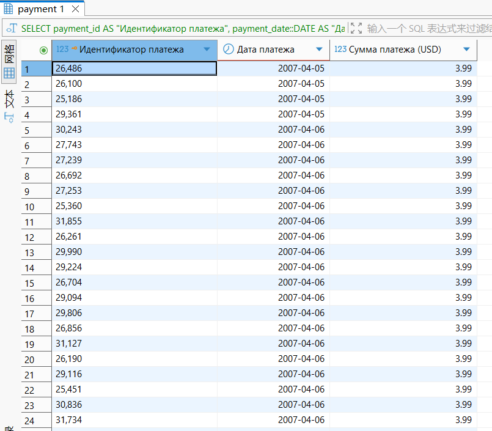

10. Показать имена, фамилии и идентификаторы всех клиентов с именами Jack, Bob или Sara, чья фамилия содержит букву «p». Переименовать колонки: с именем — в «Имя», с идентификатором — в «Идентификатор», с фамилией — в «Фамилия». Отсортировать клиентов по возрастанию идентификатора.

     ​`SELECT
       customer_id AS "Идентификатор",  
       first_name AS "Имя",            
       last_name AS "Фамилия"         
     FROM customer
     WHERE
       first_name IN ('Jack', 'Bob', 'Sara')
       AND last_name ILIKE '%p%'
     ORDER BY "Идентификатор" ASC;`

     

11. \*Работа с собственной таблицей студентов\* – Создать таблицу студентов с полями: имя, фамилия, возраст, дата рождения и адрес. Все поля должны запрещать внесение пустых значений (NOT NULL).

     ​`CREATE TABLE students (
       id SERIAL PRIMARY KEY,  
       first_name VARCHAR(50) NOT NULL,
       last_name VARCHAR(50) NOT NULL,
       age INT NOT NULL,
       birth_date DATE NOT NULL,
       address VARCHAR(100) NOT NULL
     );`

     

 – Внести в таблицу одного студента с id \> 50.

​`INSERT INTO students (id, first_name, last_name, age, birth_date, address)
VALUES (51, 'Ivan', 'Petrov', 20, '2004-01-15', 'Moscow, Lenina st. 10');`

 – Просмотреть текущие записи таблицы.

​`SELECT * FROM students;`

 – Внести несколько записей одним запросом, используя автоинкремент id.

​`INSERT INTO students (first_name, last_name, age, birth_date, address)
VALUES 
('Maria', 'Sidorova', 19, '2005-03-22', 'Saint Petersburg, Nevsky pr. 5'),
('Alex', 'Kuznetsov', 21, '2003-07-08', 'Kazan, Baumana st. 12');`

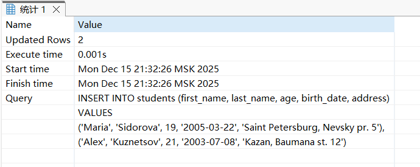

 – Снова просмотреть текущие записи таблицы.

​`SELECT * FROM students;`

 – Удалить одного выбранного студента.

​`DELETE FROM students WHERE id = 51;`

 – Вывести полный список студентов.

​`SELECT * FROM students;`

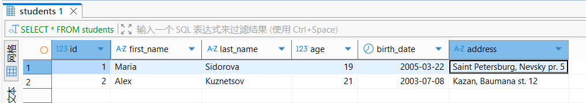

 – Удалить таблицу студентов.

​`SELECT * FROM students;`

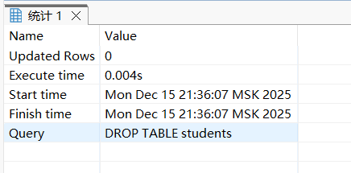

 – Выполнить запрос на выборку из таблицы студентов и вывести его результат (показать, что таблица удалена).

​`SELECT * FROM students;`

###### JOIN и агрегатные функции

12. Вывести количество уникальных имен клиентов.

     ​`SELECT COUNT(DISTINCT first_name) AS unique_first_names FROM customer;`

     

13. Вывести 5 самых часто встречающихся сумм оплаты: саму сумму, датытаких оплат, количество платежей с этой суммой и общую сумму этихплатежей.

     ​`WITH payment_amount_stats AS (
       SELECT
         amount AS payment_sum,  
         ARRAY_AGG(payment_date::DATE) AS payment_dates,
         COUNT(payment_id) AS payment_count,  
         SUM(amount) AS total_amount 
       FROM payment
       GROUP BY amount  
     )`

     ​`SELECT
       payment_sum AS "Сумма платежа",
       payment_dates AS "Даты платежей",  -- 日期数组（或替换为payment_dates_str）
       payment_count AS "Количество платежей",
       total_amount AS "Общая сумма платежей"
     FROM payment_amount_stats
     ORDER BY payment_count DESC
     LIMIT 5;`

     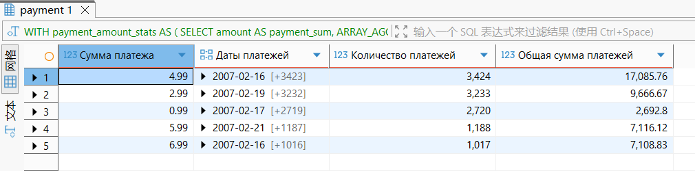

14. Вывести количество ячеек (записей) в инвентаре для каждого магазина.

     ​`SELECT
       store_id AS "Идентификатор магазина",
       COUNT(inventory_id) AS "Количество записей в инвентаре"
     FROM inventory
     GROUP BY store_id  
     ORDER BY store_id ASC;`

     
15. Вывести адреса всех магазинов, используя соединение таблиц (JOIN).

     ​`SELECT
       s.store_id AS "Идентификатор магазина",
       a.address AS "Улица/адрес",
       a.district AS "Район/область",
       a.postal_code AS "Почтовый индекс",
       a.phone AS "Телефон"
     FROM store s
     INNER JOIN address a 
       ON s.address_id = a.address_id  
     ORDER BY s.store_id ASC;`

     
16. Вывести полные имена всех клиентов и всех сотрудников в одну колонку (объединенный список).

     ​`SELECT
       CONCAT(first_name, ' ', last_name) AS "Полное имя"  
     FROM customer
     UNION ALL  
     SELECT
       CONCAT(first_name, ' ', last_name) AS "Полное имя"
     FROM staff
     ORDER BY "Полное имя" ASC;`

     

17. Вывести имена клиентов, которые не совпадают ни с одним именем сотрудников (операция EXCEPT или аналог).

     ​`SELECT
       first_name AS "Имена клиентов (не совпадают с сотрудниками)"
     FROM customer
     EXCEPT
     SELECT
       first_name
     FROM staff
     ORDER BY "Имена клиентов (не совпадают с сотрудниками)" ASC;`

     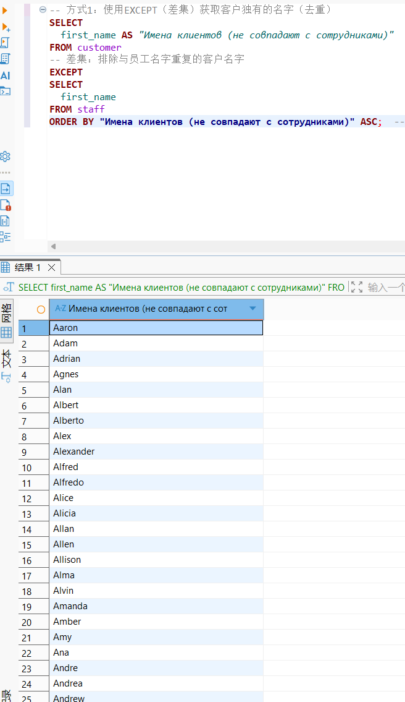

18. Вывести, кто (customer\_id), когда (rental\_date, приведенная к типу date) и у кого (staff\_id) брал диски в аренду в июне 2005 года.

     ​`SELECT
       customer_id AS "Идентификатор клиента",  
       rental_date::DATE AS "Дата аренды",      
       staff_id AS "Идентификатор сотрудника"   
     FROM rental
     WHERE
       rental_date BETWEEN '2005-06-01' AND '2005-06-30 23:59:59'
     ORDER BY "Дата аренды" ASC, "Идентификатор клиента" ASC;`

     

19. Вывести идентификаторы всех клиентов, у которых 40 и более оплат. Для

каждого такого клиента посчитать средний размер транзакции, округлить его

до двух знаков после запятой и вывести в отдельном столбце.

​`SELECT
  customer_id AS "Идентификатор клиента",
  COUNT(payment_id) AS "Количество платежей",  
  ROUND(AVG(amount), 2) AS "Средний размер транзакции" 
FROM payment
GROUP BY customer_id  
HAVING COUNT(payment_id) >= 40  
ORDER BY "Количество платежей" DESC;`

20. Вывести идентификатор актера, его полное имя и количество фильмов, в

которых он снялся. Определить актера, снявшегося в наибольшем

количестве фильмов (группировать по id актера).

​`SELECT
  a.actor_id AS "Идентификатор актера",
  CONCAT(a.first_name, ' ', a.last_name) AS "Полное имя актера",
  COUNT(fa.film_id) AS "Количество фильмов"
FROM actor a
JOIN film_actor fa ON a.actor_id = fa.actor_id
GROUP BY a.actor_id, a.first_name, a.last_name
HAVING COUNT(fa.film_id) = (
  SELECT MAX(film_count) 
  FROM (
    SELECT COUNT(film_id) AS film_count 
    FROM film_actor 
    GROUP BY actor_id
  ) AS subquery
)
ORDER BY a.actor_id ASC;`

21. Посчитать выручку по каждому месяцу работы проката. Месяц должен

определяться по дате аренды (rental\_date), а не по дате оплаты (payment\_date).

Округлить выручку до одного знака после запятой. Отсортировать строки в

хронологическом порядке. В отчете должен присутствовать месяц, в который

не было выручки (нет данных о платежах).

​`WITH all_months AS (
  SELECT generate_series(1, 12) AS month_num  
),
monthly_revenue AS (
  SELECT
    EXTRACT(MONTH FROM r.rental_date) AS rental_month,  
    ROUND(SUM(p.amount), 1) AS total_revenue  
  FROM rental r
  LEFT JOIN payment p ON r.rental_id = p.rental_id  
  WHERE EXTRACT(YEAR FROM r.rental_date) = 2005  
  GROUP BY rental_month
)`

​`SELECT
  am.month_num AS "Месяц (2005 год)",
  COALESCE(mr.total_revenue, 0.0) AS "Выручка (USD)"  
FROM all_months am
LEFT JOIN monthly_revenue mr ON am.month_num = mr.rental_month
ORDER BY am.month_num ASC;  -- 按月份升序（chronological order）`

22. Найти средний платеж по каждому жанру фильма. Отобразить только те

жанры, к которым относится более 60 различных фильмов. Округлить среднийплатеж до двух знаков после запятой и дать понятные названия столбцам.

Отсортировать жанры по убыванию среднего платежа.

​`WITH category_film_payment AS (
  SELECT
    c.category_id,
    c.name AS genre_name,  
    COUNT(DISTINCT f.film_id) AS film_count,  
    AVG(p.amount) AS avg_payment  
  FROM category c
  JOIN film_category fc ON c.category_id = fc.category_id
  JOIN film f ON fc.film_id = f.film_id
  JOIN inventory i ON f.film_id = i.film_id
  JOIN rental r ON i.inventory_id = r.inventory_id
  LEFT JOIN payment p ON r.rental_id = p.rental_id  
  GROUP BY c.category_id, c.name  
)
SELECT
  genre_name AS "Название жанра",
  film_count AS "Количество различных фильмов",  
  ROUND(avg_payment, 2) AS "Средний размер платежа (USD)"  
FROM category_film_payment
WHERE film_count > 60  
ORDER BY "Средний размер платежа (USD)" DESC;`

23. Определить, какие фильмы чаще всего берут напрокат по субботам.

Вывести названия первых 5 самых популярных фильмов. При одинаковой

популярности отдать предпочтение фильму, который идет раньше по

алфавиту.

​`
WITH saturday_rentals AS (
  SELECT
    f.film_id,
    f.title AS film_title,
    COUNT(r.rental_id) AS rental_count 
  FROM film f
  JOIN inventory i ON f.film_id = i.film_id
  JOIN rental r ON i.inventory_id = r.inventory_id
  WHERE
    EXTRACT(DOW FROM r.rental_date) = 6
  GROUP BY f.film_id, f.title  
)
SELECT
  film_title AS "Название фильма",
  rental_count AS "Количество аренд (суббота)" 
FROM saturday_rentals
ORDER BY
  rental_count DESC,  
  film_title ASC     
LIMIT 5; `

###### Оконные функции и простые запросы

24. Для каждой оплаты вывести сумму, дату и день недели (название дня

недели текстом).、

​`
SELECT
  amount AS "Сумма платежа (USD)",
  payment_date::DATE AS "Дата платежа",
  CASE EXTRACT(DOW FROM payment_date)
    WHEN 0 THEN 'Воскресенье'
    WHEN 1 THEN 'Понедельник'
    WHEN 2 THEN 'Вторник'
    WHEN 3 THEN 'Среда'
    WHEN 4 THEN 'Четверг'
    WHEN 5 THEN 'Пятница'
    WHEN 6 THEN 'Суббота'
  END AS "День недели (рус)"
FROM payment
ORDER BY payment_date ASC;`

25. ‍

1. Для каждой оплаты вывести:

• сумму платежа;

• дату платежа;

• день недели, соответствующий дате платежа, в текстовом виде (например:

«понедельник», «вторник» и т.п.).

​`
SELECT
  amount AS "Сумма платежа (USD)",
  payment_date::DATE AS "Дата платежа",
  CASE EXTRACT(DOW FROM payment_date)
    WHEN 0 THEN 'воскресенье'
    WHEN 1 THEN 'понедельник'
    WHEN 2 THEN 'вторник'
    WHEN 3 THEN 'среда'
    WHEN 4 THEN 'четверг'
    WHEN 5 THEN 'пятница'
    WHEN 6 THEN 'суббота'
  END AS "День недели"
FROM payment
ORDER BY payment_date ASC; `

2. Распределить фильмы по трем категориям в зависимости от длительности:

• «Короткие» — менее 70 минут;

• «Средние» — от 70 минут (включительно) до 130 минут (не включая 130);

• «Длинные» — от 130 минут и более.

Для каждой категории необходимо:

• посчитать количество прокатов (то есть сколько раз фильмы этой категории

брались в аренду);

• посчитать количество фильмов, которые относятся к этой категории и хотя

бы один раз сдавались в прокат.

Фильмы, у которых не было ни одного проката, не должны учитываться в

подсчете количества фильмов в категории. Продумать, какой тип соединения

таблиц нужно использовать, чтобы этого добиться.

​`
WITH film_duration_category AS (
  SELECT
    f.film_id,
    f.length,
    CASE
      WHEN f.length < 70 THEN 'Короткие'
      WHEN f.length >= 70 AND f.length < 130 THEN 'Средние'
      WHEN f.length >= 130 THEN 'Длинные'
    END AS duration_category
  FROM film f
),
rented_films AS (
  SELECT
    fdc.duration_category,
    fdc.film_id,
    COUNT(r.rental_id) AS rental_count_per_film 
  FROM film_duration_category fdc
  -- INNER JOIN：
  INNER JOIN inventory i ON fdc.film_id = i.film_id
  INNER JOIN rental r ON i.inventory_id = r.inventory_id
  GROUP BY fdc.duration_category, fdc.film_id
)
SELECT
  duration_category AS "Категория по длительности",
  SUM(rental_count_per_film) AS "Общее количество прокатов",  
  COUNT(film_id) AS "Количество фильмов с прокатом"  
FROM rented_films
GROUP BY duration_category
ORDER BY
  -- （Короткие → Средние → Длинные）
  CASE duration_category
    WHEN 'Короткие' THEN 1
    WHEN 'Средние' THEN 2
    WHEN 'Длинные' THEN 3
  END ASC;`

Для дальнейших заданий считать, что создана таблица weekly\_revenue, в

которой для каждой недели и года хранится суммарная выручка компании за

эту неделю (на основании данных о прокатах и платежах).

​`
CREATE TABLE weekly_revenue (
    year_num INT NOT NULL,                
    week_num INT NOT NULL,               
    weekly_revenue NUMERIC(10, 2) NOT NULL, 
    payment_count INT NOT NULL,
    CONSTRAINT pk_weekly_revenue PRIMARY KEY (year_num, week_num),
    CONSTRAINT chk_week_num CHECK (week_num BETWEEN 1 AND 53),
    CONSTRAINT chk_revenue_non_negative CHECK (weekly_revenue >= 0),
    CONSTRAINT chk_payment_count_non_negative CHECK (payment_count >= 0)
);`

​`
INSERT INTO weekly_revenue (year_num, week_num, weekly_revenue, payment_count)
SELECT
    EXTRACT(YEAR FROM p.payment_date)::INT AS year_num,
    EXTRACT(WEEK FROM p.payment_date)::INT AS week_num,
    ROUND(SUM(p.amount), 2) AS weekly_revenue,
    COUNT(p.payment_id) AS payment_count
FROM payment p
GROUP BY year_num, week_num
ORDER BY year_num ASC, week_num ASC;`

26. На основе таблицы weekly\_revenue рассчитать накопленную

(кумулятивную) сумму недельной выручки бизнеса. Вывести все столбцы таблицы weekly\_revenue и добавить к ним столбец с

накопленной выручкой. Накопленную выручку округлить до целого числа.

​`SELECT
  wr.*,
  ROUND(
    SUM(wr.weekly_revenue) OVER (
      ORDER BY wr.year_num ASC, wr.week_num ASC
      ROWS BETWEEN UNBOUNDED PRECEDING AND CURRENT ROW 
    ),
    0
  ) AS "Накопленная выручка (целое число)"
FROM weekly_revenue wr
ORDER BY wr.year_num ASC, wr.week_num ASC;`

27. На основе таблицы weekly\_revenue рассчитать скользящую среднюю

недельной выручки, используя для расчета три недели: предыдущую, текущую

и следующую.

Вывести всю таблицу weekly\_revenue и добавить:

• столбец с накопленной суммой выручки;

• столбец со скользящей средней недельной выручки.

Скользящую среднюю округлить до целого числа.

​`SELECT
  wr.*,
  ROUND(
    SUM(wr.weekly_revenue) OVER (
      ORDER BY wr.year_num ASC, wr.week_num ASC
      ROWS BETWEEN UNBOUNDED PRECEDING AND CURRENT ROW
    ),
    0
  ) AS "Накопленная выручка (целое число)",
  ROUND(
    AVG(wr.weekly_revenue) OVER (
      ORDER BY wr.year_num ASC, wr.week_num ASC
      ROWS BETWEEN 1 PRECEDING AND 1 FOLLOWING 
    ),
    2
  ) AS "Скользящая средняя (3 недели)"
FROM weekly_revenue wr
ORDER BY wr.year_num ASC, wr.week_num ASC;`

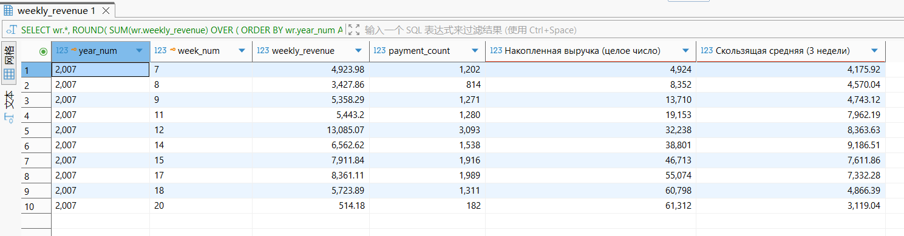

28. ‍

Рассчитать прирост недельной выручки бизнеса в процентах по сравнению с

предыдущей неделей.

Прирост в процентах определяется как:

(текущая недельная выручка – выручка предыдущей недели) / выручка

предыдущей недели × 100%.

Вывести всю таблицу weekly\_revenue и добавить:

• столбец с накопленной суммой выручки;

• столбец со скользящей средней;

• столбец с приростом недельной выручки в процентах.

Значение прироста в процентах округлить до двух знаков после запятой.

​`
SELECT
  wr.*,
  ROUND(
    SUM(wr.weekly_revenue) OVER (
      ORDER BY wr.year_num ASC, wr.week_num ASC
      ROWS BETWEEN UNBOUNDED PRECEDING AND CURRENT ROW
    ),
    0
  ) AS "Накопленная выручка (целое число)",
  ROUND(
    AVG(wr.weekly_revenue) OVER (
      ORDER BY wr.year_num ASC, wr.week_num ASC
      ROWS BETWEEN 1 PRECEDING AND 1 FOLLOWING
    ),
    2
  ) AS "Скользящая средняя (3 недели)",
  ROUND(
    (wr.weekly_revenue - LAG(wr.weekly_revenue, 1) OVER (
      ORDER BY wr.year_num ASC, wr.week_num ASC
    )) 
    / NULLIF(LAG(wr.weekly_revenue, 1) OVER (
      ORDER BY wr.year_num ASC, wr.week_num ASC
    ), 0) * 100,
    2
  ) AS "Прирост выручки (%) по сравнению с предыдущей неделей"
FROM weekly_revenue wr
ORDER BY wr.year_num ASC, wr.week_num ASC;`

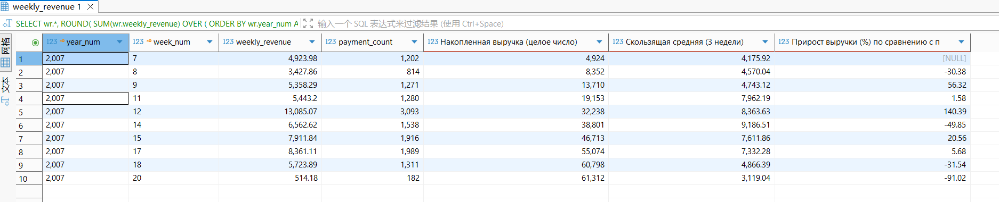

‍
