# HW4

Install software on a virtual machine

Use PuTTY to connect and log in

```bash
docker exec -it clickhouse-server clickhouse-client
```

```bash
li-virtual-machine :) SELECT * FROM system.zookeeper WHERE path = '/' LIMIT 5;


SELECT *
FROM system.zookeeper
WHERE path = '/'
LIMIT 5

Query id: 39fdfba9-32b2-4215-9244-b4f96209f462

   ┌─name───────┬─value─┬─path─┐
1. │ zookeeper  │       │ /    │
2. │ clickhouse │       │ /    │
   └────────────┴───────┴──────┘

2 rows in set. Elapsed: 0.004 sec.
```

Connect to the database using DBeaver

1.Create a test database

```bash
CREATE DATABASE IF NOT EXISTS vk_hw4;
USE vk_hw4;
```


2.In the created database, create a table using the MergeTree engine.

```bash
CREATE TABLE IF NOT EXISTS test_table (
    int_val UInt64,
    uuid_val UUID,
    dt_val DateTime,
    str_val String
) ENGINE = MergeTree()
ORDER BY int_val;
```

3.The table must have at least four columns, and you must use different types of data (each column has a different type).


4.Fill the table with test data

```bash

INSERT INTO test_table (int_val, uuid_val, dt_val, str_val)
SELECT q.int_val, q.uuid_val, toDate(q.dt_val), q.str_val 
FROM (
    SELECT 
        modulo(rand(), 999) + 1 AS int_val,
        generateUUIDv4() AS uuid_val,
        now() - interval rand()/1000 second AS dt_val,
        rand() / 500000 AS int_val_2,
        multiIf(
            int_val_2 <= 1500, 'A',
            int_val_2 <= 3000, 'B',
            int_val_2 <= 4500, 'C',
            int_val_2 <= 6000, 'D',
            int_val_2 <= 7300, 'E',
            'F'
        ) AS str_val
    FROM numbers(10000000)  # 生成1000万条数据
) q;
```

​`SELECT * FROM test_table LIMIT 10;`

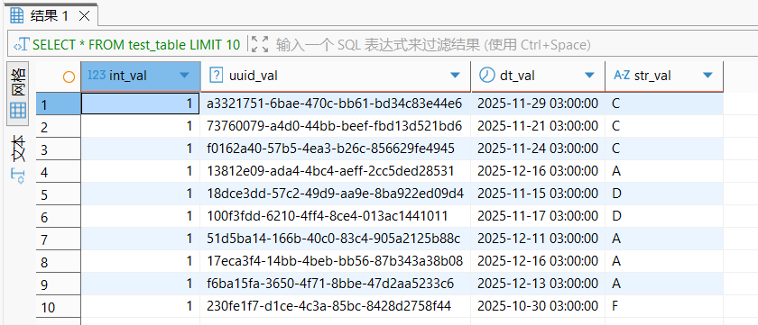

5.Perform any analytical queries on the created tables, including: – Grouping by columns; – Using aggregate functions

```bash
SELECT 
    str_val,
    count() AS total_count,
    count(DISTINCT uuid_val) AS unique_uuid_count
FROM test_table
GROUP BY str_val
ORDER BY total_count DESC;
```


6.View the contents of the following ClickHouse system tables

– system.clusters

​`SELECT * FROM system.clusters;`

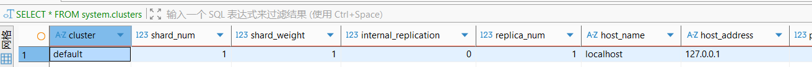

– system.macros

​`SELECT * FROM system.macros;`

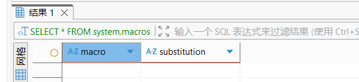

– system.zookeeper

​`SELECT * FROM system.zookeeper WHERE path = '/';`

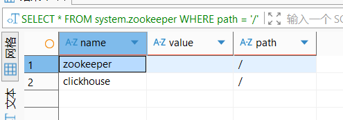

– system.distributed_ddl_queue;

​`SELECT * FROM system.distributed_ddl_queue; `


– system.replication_queue;

​`SELECT * FROM system.replication_queue;`

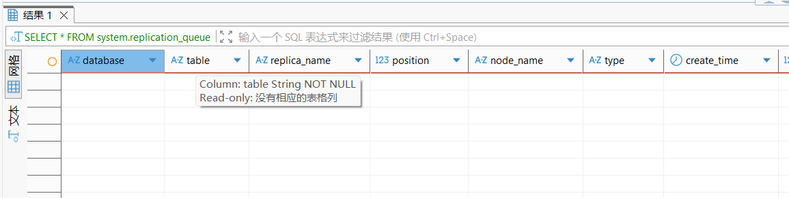

– system.trace_log

​`SELECT * FROM system.trace_log;`

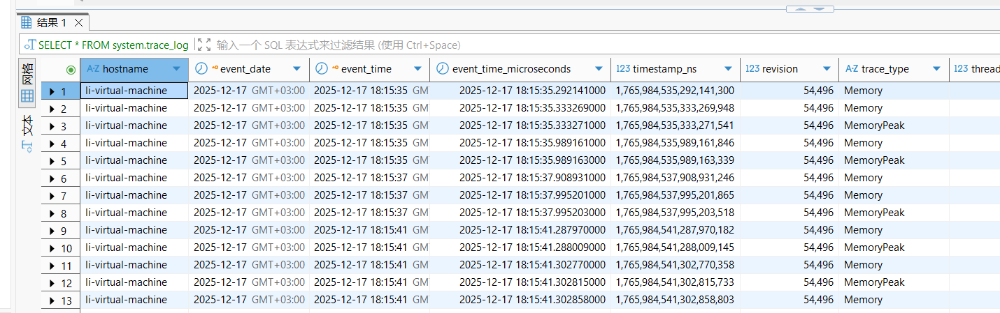

7.Check the operation of the following function

– getMacro

```bash
<yandex>
    <macros>
        <cluster>default_cluster</cluster>  
        <shard>shard1</shard>               
        <replica>replica1</replica>         
    </macros>
</yandex>
```

​`SELECT getMacro('cluster');`  

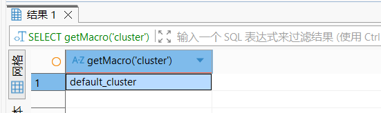

– clusterAllReplicas

```bash
<yandex>
    <remote_servers>
        <default_cluster>
            <shard>
                <replica> 
                    <host>localhost</host> 
                    <port>9000</port>  
                    <user>default</user>  
                    <password></password>  
                </replica>
            </shard>
        </default_cluster>
    </remote_servers>
</yandex>
```

​`SELECT *
FROM clusterAllReplicas('default', system.one);`


8.Use system tables to analyze and record the following metrics: —— query execution time and the amount of memory consumed;

```bash
SELECT
    query,
    query_duration_ms,
    read_rows,
    read_bytes,
    memory_usage
FROM system.query_log
WHERE
    type = 'QueryFinish'
    AND query LIKE '%FROM test_table%'
ORDER BY event_time DESC
LIMIT 5;
```


– The compressed form of the disk space occupied by the table; the uncompressed form; the volume occupied by the primary index;

```bash
SELECT
    table,
    round(sum(bytes_on_disk) / 1024 / 1024, 2) AS compressed_mb,
    round(sum(data_uncompressed_bytes) / 1024 / 1024, 2) AS uncompressed_mb,
    sum(primary_key_bytes_in_memory) AS primary_key_b
FROM system.parts
WHERE database = 'vk_hw4'
AND table = 'test_table'
GROUP BY table;
```

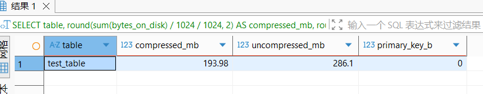

– The compressed form of the disk space occupied by the table; the uncompressed form; the volume occupied by the primary index;

```bash
SELECT
    column,
    round(sum(column_bytes_on_disk) / 1024 / 1024, 3) AS compressed_mb,
    round(sum(column_data_uncompressed_bytes) / 1024 / 1024, 3) AS uncompressed_mb
FROM system.parts_columns
WHERE database = 'vk_hw4'
AND table = 'test_table'
GROUP BY column
ORDER BY compressed_mb DESC;
```


9.Create two tables using the MergeTree engine。

```bash
CREATE TABLE vk_hw4.batch_small (
    id UInt64,
    region String,
    date_birth Date,
    gender UInt8
) ENGINE = MergeTree()
ORDER BY id;


CREATE TABLE vk_hw4.batch_large_target (
    id UInt64,
    region String,
    date_birth Date,
    gender UInt8
) ENGINE = MergeTree()
ORDER BY id;
```

10.For the second table, create an additional table using the buffer engine, through which data will be inserted.。

```bash
CREATE TABLE vk_hw4.batch_large_buffer (
    id UInt64,
    region String,
    date_birth Date,
    gender UInt8
) ENGINE = Buffer(
    vk_hw4,          -- 目标数据库
    batch_large_target,  -- 目标表
    16,               -- 内存块数
    1048576,          -- 单块最小大小（1MB）
    10485760,         -- 单块最大大小（10MB）
    10,               -- 块数阈值（刷盘）
    100,              -- 时间阈值（刷盘，秒）
    1000000,          -- 单块最大行数
    10000000          -- 总块最大行数
);
```

11.Use a script to automatically insert records into two tables simultaneously. Insertions into the first MergeTree table should be done in small batches.。

Inserting into the second MergeTree table should be buffered in large quantities through the Buffer engine.

```bash
#!/bin/bash

insert_small() {
    for ((i=0; i<1000; i++)); do
        clickhouse-client -q "
            INSERT INTO vk_hw4.batch_small (id, region, date_birth, gender)
            SELECT 
                rand() AS id,
                toString(modulo(rand(), 70) + 20) AS region,
                toDate('1970-01-01') + interval floor(randNormal(10000, 1700)) day AS date_birth,
                if(modulo(rand(), 3) = 1, 1, 0) AS gender
            FROM numbers(100);
        "
    done
    echo "small batch finshed"
}

insert_large() {
    for ((i=0; i<10; i++)); do
        clickhouse-client -q "
            INSERT INTO vk_hw4.batch_large_buffer (id, region, date_birth, gender)
            SELECT 
                rand() AS id,
                toString(modulo(rand(), 70) + 20) AS region,
                toDate('1970-01-01') + interval floor(randNormal(10000, 1700)) day AS date_birth,
                if(modulo(rand(), 3) = 1, 1, 0) AS gender
            FROM numbers(100000);
        "
    done
    echo "buffer batch finished"
}

insert_small &
insert_large &
wait
echo "all finished"
```

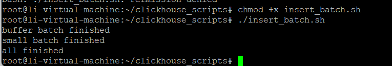

​`SELECT 'batch_small' AS table, count() AS row_count FROM vk_hw4.batch_small UNION ALL SELECT 'batch_large_target' AS table, count() AS row_count FROM vk_hw4.batch_large_target;`

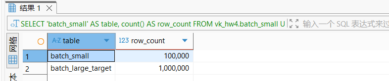

```bash
SELECT
    table,
    active,
    count() AS parts_count,
    sum(rows) AS rows_count
FROM system.parts
WHERE database = 'vk_hw4'
AND table IN ('batch_small', 'batch_large_target')
GROUP BY table, active
ORDER BY table, active DESC;
```


15.Create a table based on the description

```bash
CREATE TABLE vk_hw4.person_data (
    id UInt64,
    region LowCardinality(String),
    date_birth Date,
    gender UInt8,
    is_marital UInt8,
    dt_create DateTime DEFAULT now()
) ENGINE = MergeTree()
ORDER BY (date_birth);
```

16.Fill the generated data into the table using the provided script.。

```bash
INSERT INTO vk_hw4.person_data (id, region, date_birth, gender, is_marital)
SELECT 
    rand() AS id,
    toString(modulo(rand(), 70) + 20) AS region,
    toDate('1970-01-01') + interval floor(randNormal(10000, 1700)) day AS date_birth,
    if(modulo(rand(), 3) = 1, 1, 0) AS gender,
    if((modulo(rand(), 70) + 20 + floor(randNormal(10000, 1700))) % 3 = 0 AND date_diff('year', date_birth, now()) > 18, 1, 0) AS is_marital
FROM numbers(100000000);
```


17.Optimize the table so that only one block (one partition) remains.。

```bash
OPTIMIZE TABLE vk_hw4.person_data FINAL DEDUPLICATE;

SELECT 
  COUNTDistinct(partition_id) AS Totalnumber, 
  arrayStringConcat(groupArrayDistinct(partition_id), ',') AS IDlist 
FROM system.parts 
WHERE database = 'vk_hw4' 
  AND `table` = 'person_data' 
  AND active = 1 
LIMIT 0, 200;
```


18.Execute the specified queries (see Appendix). For each request:

- Determine the average execution time of consecutive runs (at least 5 times);
- Record the number of rows being processed (the PROCESSED parameter returned by the ClickHouse client);
- Check the memory usage occupied by the primary key of the table.

memory capacity

```bash
 SELECT
     table,
     round(sum(primary_key_bytes_in_memory) / 1024 / 1024, 2) AS primary_key_mb
 FROM system.parts
 WHERE database = 'vk_hw4'
 AND table = 'person_data'
 AND active
 GROUP BY table;
```


Request 1：

```bash
SELECT 
    region,
    countIf(gender = 1 AND date_diff('year', date_birth, now()) BETWEEN 20 AND 40) AS cnt_male,
    countIf(gender = 0 AND date_diff('year', date_birth, now()) BETWEEN 18 AND 30) AS cnt_female
FROM vk_hw4.person_data
WHERE date_birth BETWEEN '2000-01-01' AND '2000-01-31' 
  AND region IN ('20', '25', '43', '59')
GROUP BY region;
```

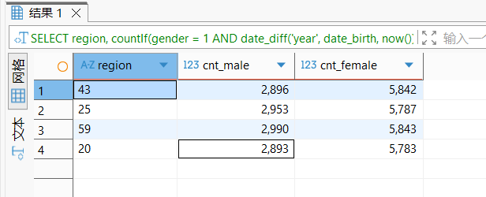

average time

```bash
SELECT
    query_duration_ms,
    read_rows,
    read_bytes
FROM system.query_log
WHERE query LIKE '%vk_hw4.person_data%'
AND type = 'QueryFinish'
ORDER BY event_time DESC
LIMIT 5;
```


3200/7=457 rows/ms

Request 2.

```bash
SELECT countIf(gender = 1 AND date_diff('year', t.date_birth, now()) BETWEEN 20 AND 40) AS cnt_male,
    countIf(gender = 0 AND date_diff('year', t.date_birth, now()) BETWEEN 18 AND 30) AS cnt_female
FROM vk_hw4.person_data t
WHERE t.is_marital = 1
AND t.region IN ('80')
GROUP BY t.region;
```


average time


3279/5=655 rows/ms

19.Optimize the ORDER BY and PRIMARY KEY of the table

```bash
CREATE TABLE vk_hw4.person_data_opt (
id          UInt64,
region      LowCardinality(String),
date_birth  Date,
gender      UInt8,
is_marital  UInt8,
dt_create   DateTime
)
ENGINE = MergeTree()
ORDER BY (region, date_birth);

INSERT INTO vk_hw4.person_data_opt
SELECT *
FROM vk_hw4.person_data;

OPTIMIZE TABLE vk_hw4.person_data_opt FINAL
```

Request 1：


3107/4=776 rows/ms    776/457=167%

Conclusion: The reading speed has increased by approximately 167%.

Request 2：

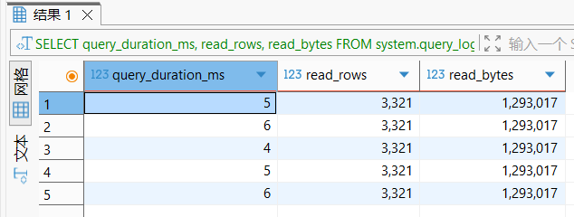

3321/4=830 rows/ms      830/655=126%

Conclusion: The reading speed has increased by approximately 126%.

Task4.Based on the table obtained from Task 2, create a new table with the same structure and data.。

Create a compression-optimized table

```bash
CREATE TABLE vk_hw4.person_data_compressed AS vk_hw4.person_data ENGINE = MergeTree()
ORDER BY (region, date_birth, is_marital);

INSERT INTO vk_hw4.person_data_compressed SELECT * FROM vk_hw4.person_data;
```

```bash
ALTER TABLE vk_hw4.person_data_compressed 
MODIFY COLUMN id UInt64 CODEC(ZSTD(1)), 
MODIFY COLUMN date_birth Date CODEC(Delta, LZ4), 
MODIFY COLUMN gender UInt8 CODEC(Delta, LZ4),
MODIFY COLUMN region LowCardinality(String) CODEC(LZ4),
MODIFY COLUMN is_marital UInt8 CODEC(Delta, LZ4),
MODIFY COLUMN dt_create DateTime CODEC(Delta, LZ4);

OPTIMIZE TABLE vk_hw4.person_data_compressed FINAL;
```

```bash
SELECT
    t1.table AS orgtable,
    round(t1.compressed_mb, 2) AS orgtable_MB,
    t2.table AS newtable,
    round(t2.compressed_mb, 2) AS newtable_MB,
    round((1 - t2.compressed_mb/t1.compressed_mb)*100, 2) AS percent
FROM (
    SELECT table, sum(bytes_on_disk)/1024/1024 AS compressed_mb FROM system.parts WHERE database='vk_hw4' AND table='person_data' AND active=1 GROUP BY table
) t1
JOIN (
    SELECT table, sum(bytes_on_disk)/1024/1024 AS compressed_mb FROM system.parts WHERE database='vk_hw4' AND table='person_data_compressed' AND active=1 GROUP BY table
) t2 ON 1=1;
```


Memory usage has decreased by 46%

Request 1

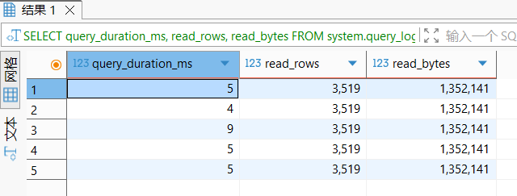

3519/5=703 rows/ms  (703-776)/776=-9%

The reading efficiency has decreased by approximately 9%

Request2

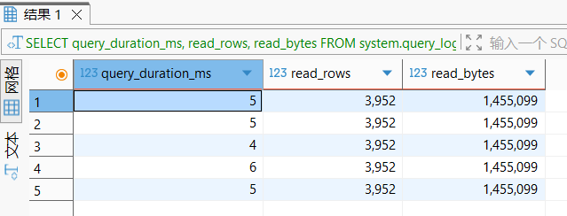

3952/5=790 rows/ms  (790-830)/830=-4.7%

The reading efficiency has decreased by approximately 5%
