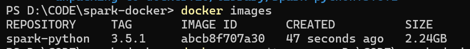
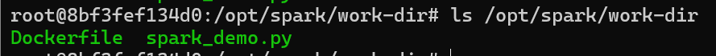

# HW5

1.prepare dockerfile

2.Execute the build command

​`docker build -t spark-python:3.5.1 .`

Verify whether the image was created successfully:

​`docker images`



3.Run the container and mount the directory

​`docker run -it --rm -v D:\CODE\spark-docker:/opt/spark/work-dir -p 4040:4040 spark-python:3.5.1`

Verify the mount:



4.Execute Spark application example

​`spark-submit spark_demo.py`

```bash
===== Spark Environment Initialized Successfully =====
Spark Version: 3.5.1
Python Version: 3.10

===== Example 1: RDD Word Count =====
Word: spark      Count: 4
Word: data       Count: 2
Word: big        Count: 2
Word: is         Count: 2
Word: python     Count: 1
Word: framework  Count: 1
Word: use        Count: 1
Word: supports   Count: 1
Word: =          Count: 1
Word: rdd        Count: 1
Word: docker     Count: 1
Word: portable   Count: 1
Word: a          Count: 1
Word: and        Count: 1
Word: dataframe  Count: 1
Word: to         Count: 1
Word: +          Count: 1
Word: easy       Count: 1
Word: with       Count: 1

===== Example 2: DataFrame Sales Data Analysis =====
root
 |-- date: string (nullable = true)
 |-- city: string (nullable = true)
 |-- category: string (nullable = true)
 |-- amount: long (nullable = true)

Original Sales Data:
+----------+---------+-----------+------+
|      date|     city|   category|amount|
+----------+---------+-----------+------+
|2025-12-01|  Beijing|Electronics|  1500|
|2025-12-01| Shanghai|   Clothing|   800|
|2025-12-02|  Beijing|Electronics|  2000|
|2025-12-02| Shanghai|Electronics|  1200|
|2025-12-03|Guangzhou|       Food|   500|
+----------+---------+-----------+------+
only showing top 5 rows


Beijing Electronics Sales Records:
+----------+-------+-----------+------+
|      date|   city|   category|amount|
+----------+-------+-----------+------+
|2025-12-01|Beijing|Electronics|  1500|
|2025-12-02|Beijing|Electronics|  2000|
+----------+-------+-----------+------+


City Sales Summary (Sorted by Total Sales Descending):
+---------+-----------+-----------+
|     city|total_sales|order_count|
+---------+-----------+-----------+
|  Beijing|       4100|          3|
|Guangzhou|       2300|          2|
| Shanghai|       2000|          2|
+---------+-----------+-----------+


===== Example 3: Spark SQL Analysis =====
Sales Records with Amount > 1000 (SQL Query):
+----------+---------+-----------+------+
|      date|     city|   category|amount|
+----------+---------+-----------+------+
|2025-12-02|  Beijing|Electronics|  2000|
|2025-12-04|Guangzhou|Electronics|  1800|
|2025-12-01|  Beijing|Electronics|  1500|
|2025-12-02| Shanghai|Electronics|  1200|
+----------+---------+-----------+------+

```

‍
